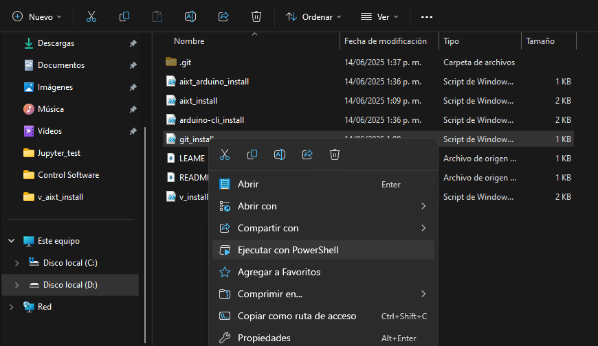

# Aixt installing scripts

This repository contains the scripts for installing the most recent version of [**_Aixt_**](https://github.com/fermarsan/aixt) Microcontrollers' Programming Framework and its dependencies.

Each script has to be run by right-clicking on it and selecting `Run with PowerShell` from the context menu.

Run the scripts in this order:

- `git_install.ps1`
- `v_install.ps1`
- `aixt_install.ps1`

For working with any of Arduino AVR boards run too:

- `arduino-cli_install.ps1`